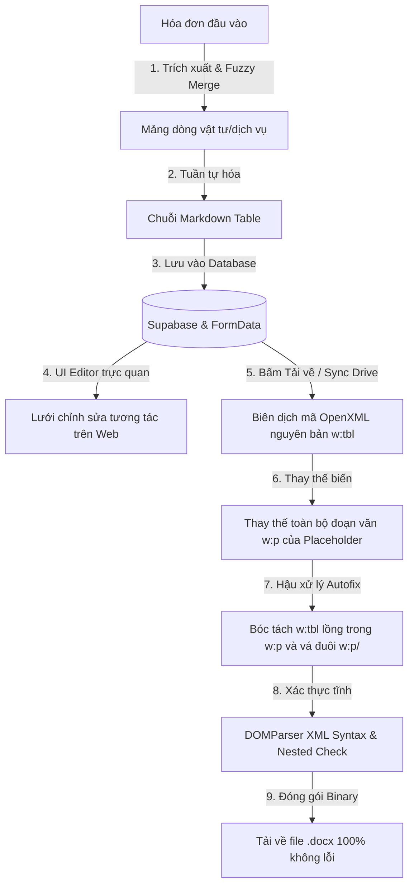

# Hướng Dẫn Kỹ Thuật: Quy Trình Sinh Bảng Word (.docx) Không Lỗi Cấu Trúc
> **Tài liệu dành cho AI và Lập trình viên**
> Tài liệu này mô tả chi tiết kiến trúc, giải thuật và các bộ lọc bảo vệ dữ liệu nhị phân/XML đã được thiết lập để xuất tệp Word (.docx) có chứa bảng từ hóa đơn mà không bao giờ bị Microsoft Word báo lỗi hỏng file (*Word encountered an error*).

---

## 📌 1. Sơ Đồ Kiến Trúc Hệ Thống (Architectural Flow)

Quy trình tự động hóa sinh bảng trải qua 5 giai đoạn khép kín:



---

## 🛠️ 2. Chi Tiết Kỹ Thuật Từng Giai Đoạn (Technical Details)

### 2.1. Trích xuất & Fuzzy Merging (Gộp thông minh)
Hệ thống lấy mảng `items` từ kết quả OCR Mistral AI của hóa đơn. Đối với các hợp đồng Nguyên Tắc (`HDNT`) hoặc Ca Máy (`HDCM`), hệ thống gộp các dòng trùng khớp *Tên*, *ĐVT* và *Đơn giá*, cộng dồn *Số lượng* và *Thành tiền*.

### 2.2. Định Dạng Lưu Trữ (Markdown Table)
Bảng được lưu trữ trong `formData` dưới dạng chuỗi Markdown Table tiêu chuẩn bằng hàm `serializeRowsToMarkdown`:
```markdown
| STT | Nội dung hàng hóa, dịch vụ | ĐVT | Số lượng | Đơn giá | Thành tiền |
|:---:|:---|:---:|---:|---:|---:|
| 1 | Cát xây tô | m3 | 150 | 200.000 | 30.000.000 |
| | TỔNG CỘNG TIỀN HÀNG | | | | 30.000.000 |
```

### 2.3. Lưới Chỉnh Sửa Tương Tác (UI Table Editor)
Trong Component [InlineTextArea](file:///d:/GitHub/Quanlyhoadon/src/App.tsx), nếu phát hiện tag bảng, giao diện chuyển sang chế độ bảng lưới tương tác. Sử dụng hàm `parseMarkdownToRows` để trích xuất dòng, cho phép thêm/xóa/sửa trên UI và tự động tuần tự hóa ngược lại Markdown theo thời gian thực.

---

## 🚫 3. Hai Quy Tắc Vàng Ngăn Ngừa Lỗi Hỏng File (Gold Rules for OOXML)

### Quy Tắc 1: KHÔNG ĐƯỢC để thẻ chạy rỗng `<w:t>` (Empty Text Run)
* **Nguyên nhân lỗi**: Nếu ô bảng trống hoặc dòng Tổng cộng có các ô phụ rỗng, mã XML cũ sinh ra các thẻ `<w:t xml:space="preserve"></w:t>`. Microsoft Word cấm tuyệt đối các thẻ `<w:t>` rỗng và sẽ báo hỏng tệp ngay lập tức khi mở.
* **Giải pháp khắc phục**: Hàm `makeCell` kiểm tra điều kiện nội dung. Nếu chuỗi rỗng, nó sẽ **bỏ qua hoàn toàn thẻ chạy `<w:r>` và thẻ chữ `<w:t>`**, chỉ trả về thẻ bao đoạn văn `<w:p>` trống:
  ```typescript
  const makeCell = (text: string, width: string, align: string, bold = false, span = 0, vAlign = '', shade = '') => {
    const escaped = escapeXml(text);
    const bTag = bold ? '<w:b/><w:bCs/>' : '';
    // Chỉ tạo thẻ <w:r> và <w:t> nếu có nội dung thực tế!
    const runTag = escaped ? `<w:r><w:rPr><w:rFonts w:ascii="Times New Roman" w:hAnsi="Times New Roman"/>${bTag}<w:sz w:val="22"/><w:szCs w:val="22"/></w:rPr><w:t xml:space="preserve">${escaped}</w:t></w:r>` : '';
    const spanTag = span ? `<w:gridSpan w:val="${span}"/>` : '';
    const vAlignTag = vAlign ? `<w:vAlign w:val="${vAlign}"/>` : '';
    const shadeTag = shade ? `<w:shd w:val="clear" w:color="auto" w:fill="${shade}"/>` : '';
    return `<w:tc><w:tcPr>${spanTag}<w:tcW w:w="${width}" w:type="dxa"/>${shadeTag}${vAlignTag}</w:tcPr><w:p><w:pPr><w:jc w:val="${align}"/><w:spacing w:before="60" w:after="60"/></w:pPr>${runTag}</w:p></w:tc>`;
  };
  ```

### Quy Tắc 2: KHÔNG ĐƯỢC để bảng `<w:tbl>` lồng trong đoạn văn `<w:p>`
* **Nguyên nhân lỗi**: Thư viện Docxtemplater thay thế biến raw XML (`[@tag]`) ngay bên trong thẻ `<w:r><w:t>`, khiến thẻ bảng `<w:tbl>` nằm lồng trong `<w:p>`. Điều này vi phạm nghiêm trọng cấu trúc phân cấp OOXML.
* **Giải pháp khắc phục**:
  1. **Regex Thay Thế Đoạn Văn Đóng Gói (Direct Regex Replacement)**:
     Thay thế toàn bộ thẻ đoạn văn `<w:p>...</w:p>` bao quanh placeholder bằng thẻ bảng `<w:tbl>` trực tiếp dưới cấp cha `<w:body>` hoặc `<w:tc>`, bảo đảm bảng là sibling (đồng cấp) chứ không phải con của paragraph.
     ```typescript
     renderedXml = renderedXml.replace(
       /<w:p\b[^>]*>(?:(?!<\/w:p>)[\s\S])*?__BANG_TABLE_PLACEHOLDER_FOR_([A-Z_]+)__(?:(?!<\/w:p>)[\s\S])*?<\/w:p>/g,
       (match, tag) => {
         const ooxmlTable = tableXmlMap[tag] || '';
         return ooxmlTable ? ooxmlTable + '<w:p/>' : '<w:p/>';
       }
     );
     ```
  2. **Thẻ Chốt Đuôi `<w:p/>`**: Bắt buộc phải thêm một thẻ đoạn văn trống `<w:p/>` ngay phía sau bảng `<w:tbl>` khi nó nằm cuối một ô bảng hoặc cuối tài liệu để đáp ứng tiêu chuẩn bắt buộc của Microsoft Word.

---

## 🔍 4. Xác Thực Tĩnh DOMParser & Kiểm Tra Lồng Thẻ (DOM Validation)

Sau khi xử lý Regex, hệ thống tiến hành kiểm tra cú pháp XML và quét đệ quy các nút cha của bảng. Nếu phát hiện bảng `<w:tbl>` vẫn bị lồng trong đoạn văn `<w:p>`, hệ thống sẽ ném lỗi chặn tệp hỏng đến tay người dùng:

```typescript
const parser = new DOMParser(); // Hoặc dom.window.DOMParser trên server
const xmlDoc = parser.parseFromString(renderedXml, "text/xml");
const parserError = xmlDoc.getElementsByTagName("parsererror");
if (parserError.length > 0) {
  throw new Error("Lỗi cú pháp XML: " + parserError[0].textContent);
}

const tables = xmlDoc.getElementsByTagName("w:tbl");
for (let i = 0; i < tables.length; i++) {
  let parent = tables[i].parentNode;
  while (parent) {
    if (parent.nodeName === "w:p") {
      throw new Error("Phát hiện lỗi cấu trúc OOXML nghiêm trọng: Thẻ bảng <w:tbl> nằm bên trong thẻ đoạn văn <w:p>.");
    }
    parent = parent.parentNode;
  }
}
```

---

## 📂 5. Danh Sách Các File Đang Tích Hợp Pipeline Này

Bất kỳ sửa đổi nào liên quan đến sinh tệp Word trong tương lai **bắt buộc** phải tuân thủ hướng dẫn này để tránh gây regression lỗi hỏng file. Hệ thống đang triển khai pipeline này đồng bộ tại:
1. **Frontend Contract Generator**: Hàm `generateDocxBlobForContract` tại [src/App.tsx](file:///d:/GitHub/Quanlyhoadon/src/App.tsx).
2. **Backend API Generator**: API Router `/api/generate` tại [server.ts](file:///d:/GitHub/Quanlyhoadon/server.ts).
3. **Frontend Document Printers**: Hàm `generateDocxBlob` tại [src/lib/docxGenerator.ts](file:///d:/GitHub/Quanlyhoadon/src/lib/docxGenerator.ts) và [src/utils/docxGenerator.ts](file:///d:/GitHub/Quanlyhoadon/src/utils/docxGenerator.ts).
