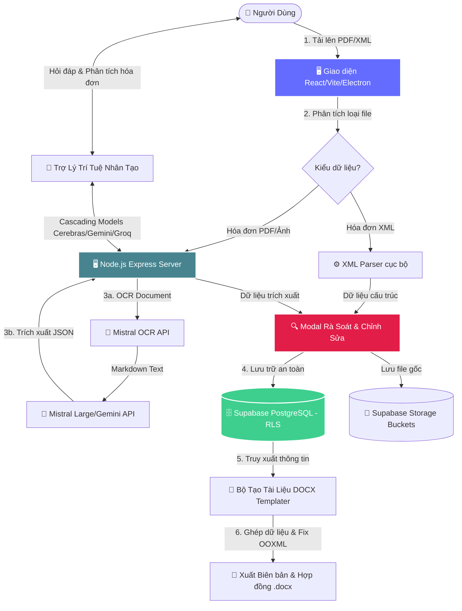

<div align="center">
  

  # 🚀 DOCUFORGE AI
  ### Hệ Thống Tự Động Hóa Trích Xuất Hóa Đơn & Quản Lý Hợp Đồng Thông Minh
  
  [](https://vitejs.dev/)
  [](https://react.dev/)
  [](https://tailwindcss.com/)
  [](https://supabase.com/)
  [](https://www.electronjs.org/)
  [](https://mistral.ai/)

  *Giải pháp chuyển đổi số toàn diện cho doanh nghiệp: Tự động hóa quy trình bóc tách hóa đơn điện tử (PDF/XML) bằng AI, kết nối đồng bộ cơ sở dữ liệu đối tác, và tự động soạn thảo Biên bản đối chiếu/Hợp đồng thương mại chỉ trong 1-Click.*
</div>

---

## 📌 Sơ Đồ Quy Trình & Kiến Trúc Hệ Thống (Workflow Architecture)

Hệ thống hoạt động trên mô hình kết hợp **Client-Server-Cloud** mạnh mẽ, bảo mật cao với **Supabase Row-Level Security (RLS)** và tích hợp trí tuệ nhân tạo (AI) đa dạng:



---

## ✨ Các Tính Năng Cốt Lõi (Core Features)

### 1. 📂 Tải Lên & Trích Xuất Hóa Đơn Điện Tử Đa Định Dạng (AI OCR & Parser)
*   **Hỗ trợ Hóa đơn XML:** Giải mã và bóc tách trực tiếp các tệp XML hóa đơn điện tử chuẩn của Tổng cục Thuế với độ chính xác tuyệt đối 100% bằng bộ phân tích cú pháp XML tự động loại bỏ namespaces phức tạp.
*   **AI-Powered PDF/Image OCR:** Áp dụng mô hình **Mistral OCR** tiên tiến nhất để nhận diện văn bản tiếng Việt có dấu trong các file PDF và hình ảnh scan mờ, sau đó dùng **Mistral Large / Gemini AI** để phân tích ngữ nghĩa và trích xuất thành cấu hình JSON chuẩn.
*   **Tự động phân loại nghiệp vụ:** Hệ thống tự động phân tích hàng hóa để phân loại hóa đơn vào 3 danh mục chính:
    *   `BB_VT` (Vật tư)
    *   `BB_CM` (Ca máy)
    *   `BB_TC` (Thi công)

### 2. 🔍 Hộp Thoại Rà Soát Dữ Liệu Thông Minh (Interactive Review Modal)
*   Trước khi ghi dữ liệu vào cơ sở dữ liệu, một giao diện chuyên nghiệp sẽ xuất hiện hiển thị song song thông tin **Người bán**, **Người mua**, **Số hóa đơn/Ký hiệu**, **Ngày lập**, và **Bảng kê sản phẩm chi tiết**.
*   Cho phép người dùng chỉnh sửa trực tiếp mọi trường thông tin bị nhận diện thiếu hoặc nhầm lẫn do chất lượng file scan thấp.
*   Tích hợp bộ chuyển đổi định dạng ngày tháng tiếng Việt (ví dụ: *"Ngày 20 tháng 12 năm 2025"*) thành định dạng chuẩn quốc tế để lưu trữ khoa học.

### 3. 📊 Bảng Điều Khiển Nâng Cao (GPU-Accelerated Dashboard)
*   **Expandable Rows (Chi tiết inline):** Nhấp chọn hóa đơn để mở rộng thông tin hàng hóa chi tiết ngay trong bảng với hiệu ứng chuyển động mượt mà 60fps nhờ áp dụng kỹ thuật **CSS Grid Auto-Row GPU-accelerated**.
*   **Tích hợp A11y (Khả năng tiếp cận):** Tuân thủ tuyệt đối tiêu chuẩn **WAI-ARIA** hỗ trợ điều khiển mở rộng hoàn toàn bằng phím (`Space`/`Enter`), tương thích tốt với Screen Readers cho người khiếm thị.
*   **Local Note Editor:** Ghi chú trực tiếp trên từng hóa đơn và lưu trữ nhanh chóng.
*   **Chống Drop FPS (Virtualization):** Khi danh sách vượt quá 200 hóa đơn, hệ thống tự động đưa ra khuyến nghị kích hoạt ảo hóa DOM (`react-window`) giúp giao diện luôn mượt mà.
*   **Chế độ di động thông minh:** Dưới độ rộng `768px`, hệ thống tự động chuyển sang chế độ hiển thị thẻ (Card-based UI) và mở hộp thoại thông tin chi tiết (Fallback Modal) để tối ưu hóa không gian.

### 4. 👥 Quản Lý Danh Sách Đối Tác Chuyên Nghiệp (Partner Profiles Management)
*   Quản lý cơ sở dữ liệu đối tác bao gồm: Mã số thuế, Tên doanh nghiệp, Địa chỉ trụ sở, Số tài khoản, Ngân hàng, Người đại diện pháp luật, Chức vụ và Giới tính.
*   **Smart Merger Address Resolution:** Hỗ trợ lưu trữ địa chỉ sau sáp nhập (`address_post_merger`). Hệ thống tự động nhận diện ngày lập hóa đơn để lấy đúng địa chỉ pháp lý tại thời điểm đó (trước hoặc sau ngày sáp nhập 01/07/2025) để chèn vào tài liệu pháp lý.

### 5. 🖨️ Tự Động Soạn Thảo Biên Bản & Hợp Đồng Thương Mại (DOCX Template Generator)
*   **Chuyển đổi 1-Click:** Dựa trên hóa đơn và hồ sơ đối tác đã lưu, hệ thống tự động sinh Biên bản đối chiếu công nợ vật tư (`BB_VT`), biên bản ca máy (`BB_CM`), hay biên bản thi công (`BB_TC`).
*   **Tạo Hợp đồng thông minh:** Chọn Đối tác A (Bên bán) và Đối tác B (Bên mua) để tạo ngay các hợp đồng mẫu chuẩn: `Template_HDCM` (Hợp đồng Ca máy), `Template_HDNT` (Hợp đồng Nguyên tắc), và `Template_HDTC` (Hợp đồng Thi công).
*   **Công nghệ OOXML Validation & Fix:** Tự động sửa lỗi cấu trúc sinh thẻ XML trong file Word (ví dụ lỗi lồng bảng `<w:tbl>` vào thẻ đoạn văn `<w:p>`), đảm bảo tệp DOCX xuất ra sạch sẽ, không bị lỗi cấu trúc khi mở trên Microsoft Word.
*   **Dịch số thành chữ tự động:** Công cụ chuyển đổi tổng số tiền thanh toán sang chuỗi chữ tiếng Việt hoàn chỉnh (chính xác đến từng chữ số lẻ).

### 6. 💬 Trợ Lý AI Tích Hợp (Conversational AI Chatbox)
*   Hộp thoại chat thông minh cho phép người dùng hỏi đáp về toàn bộ dữ liệu hóa đơn, yêu cầu tóm tắt thông số tài chính hoặc hướng dẫn vận hành.
*   **Cơ chế dự phòng Cascading AI:** Server tự động liên kết đa nền tảng. Nếu nhà cung cấp AI chính gặp sự cố, hệ thống sẽ tự động chuyển tiếp truy vấn qua các dịch vụ dự phòng để đảm bảo hoạt động liên tục:
    $$\text{Cerebras (Llama 3.1)} \longrightarrow \text{Gemini (1.5 Flash)} \longrightarrow \text{Groq} \longrightarrow \text{OpenRouter (Qwen)}$$

### 7. 🖥️ Đa Nền Tảng (Hybrid Desktop & Web Client)
*   Có thể khởi chạy trực tiếp trên trình duyệt như một ứng dụng Web truyền thống hoặc biên dịch thành ứng dụng Desktop (.exe) siêu tốc bằng **Electron** & **electron-builder**.

---

## 🖥️ Trực Quan Giao Diện Hệ Thống (UI Layout Mockup)

Dưới đây là sơ đồ bố trí giao diện hiện đại của **DocuForge AI** (với phong cách Glassmorphism và Dark Mode cao cấp):

```
+---------------------------------------------------------------------------------------------------------+
|  DocuForge AI    [🔍 Tìm kiếm hóa đơn, đối tác...]                           👤 Duy Bảo | 🟢 AI Sẵn sàng  |
+---------------------------------------------------------------------------------------------------------+
| 📊 Bảng điều khiển   |  BẢNG ĐIỀU KHIỂN HÓA ĐƠN                                     [+ Tải Hóa Đơn Mới] |
| 📂 Tải lên hóa đơn   |  +-----------------------------------------------------------------------------+ |
| 👥 Đối tác           |  | Số HĐ   | Ngày Lập   | Đơn Vị Bán         | Tổng Tiền (VND)  | Trạng Thái  | |
| 📝 Tạo hợp đồng     |  +--------+------------+--------------------+------------------+-------------+ |
| 🗂️ Tài liệu đã tạo  |  | 00234  | 20/12/2025 | Công ty Vật tư An  |      150,000,000 |  🟢 Đã duyệt| |
| ⚙️ Hệ thống          |  | >>> [CHI TIẾT DÒNG MỞ RỘNG - ACCORDION MODE ACTIVE]                         | |
|                      |  |     - Địa chỉ: 123 Đường Láng, Hà Nội                                       | |
|----------------------|  |     - Mã số thuế: 0102345678                                                | |
| 💬 Trợ lý AI         |  |     - Chi tiết hàng hóa: Bê tông tươi mác 250 (50 m3)                       | |
| +------------------+ |  |     [📝 Chỉnh sửa ghi chú]   [📄 Xuất Biên Bản Vật Tư]   [❌ Xóa Hóa Đơn]   | |
| | Hỏi trợ lý AI... | |  |-----------------------------------------------------------------------------| |
| | [ Gửi câu hỏi ]  | |  | 00235  | 21/12/2025 | Cơ giới Bình Minh  |       45,000,000 |  🟡 Đang xử lý| |
| +------------------+ |  +-----------------------------------------------------------------------------+ |
+---------------------------------------------------------------------------------------------------------+
```

---

## 📘 Hướng Dẫn Sử Dụng Chi Tiết (Detailed User Guide)

### Bước 1: Khởi Động & Đăng Nhập Hệ Thống
1.  Truy cập hệ thống qua trình duyệt hoặc mở phần mềm **DocuForge** trên máy tính.
2.  Nhấp chọn nút **Đăng nhập Google** ở góc dưới thanh điều hướng bên trái (Sidebar).
3.  Hoàn thành đăng nhập qua tài khoản Google. Trạng thái kết nối sẽ lập tức chuyển sang **🟢 AI: Sẵn sàng**.

### Bước 2: Tải Lên & Trích Xuất Hóa Đơn (Tab "Tải lên hóa đơn")
1.  Nhấp chọn Tab **Tải lên hóa đơn** trên Sidebar.
2.  Kéo & Thả (hoặc click để chọn) tệp hóa đơn của bạn. Hệ thống hỗ trợ định dạng **PDF, XML, JPG, PNG** (Có thể chọn tải lên hàng loạt nhiều tệp cùng lúc).
3.  Hệ thống sẽ tiến hành nén ảnh thông minh để tối ưu hóa băng thông, sau đó tự động gửi lên server để phân tích:
    *   *Đối với file XML:* Hệ thống bóc tách dữ liệu thẻ XML chính xác trong vòng <0.5 giây.
    *   *Đối với file PDF/Ảnh:* AI OCR sẽ chạy nhận diện văn bản tiếng Việt và chuyển cấu trúc sang dạng JSON trong vòng 3 - 5 giây.

### Bước 3: Rà Soát & Duyệt Dữ Liệu (Review & Edit Modal)
1.  Sau khi quá trình trích xuất hoàn tất, hộp thoại **Kiểm tra kết quả bóc tách** sẽ tự động hiển thị.
2.  Kiểm tra các thông tin:
    *   **Thông tin hóa đơn:** Số HĐ, Ký hiệu, Ngày lập, Thuế suất GTGT.
    *   **Thông tin bên Bán & Mua:** Tên công ty, MST, Địa chỉ, Số tài khoản & Ngân hàng.
    *   **Chi tiết sản phẩm:** Kiểm tra số lượng, đơn giá, thành tiền trong bảng.
3.  Chỉnh sửa trực tiếp trên ô nhập liệu nếu phát hiện sai sót.
4.  Nhấp **Lưu Vào Hệ Thống** để chính thức ghi nhận thông tin vào Supabase DB và tải tệp tin gốc lên Storage Bucket bảo mật.

### Bước 4: Quản Lý & Xem Chi Tiết Hóa Đơn (Tab "Bảng điều khiển")
1.  Chọn Tab **Bảng điều khiển** để xem danh sách toàn bộ các hóa đơn đã được lưu.
2.  Sử dụng thanh tìm kiếm (theo tên đối tác, số hóa đơn) hoặc bộ lọc theo phân loại hóa đơn (`Vật tư`, `Ca máy`, `Thi công`) để lọc dữ liệu.
3.  **Xem chi tiết hóa đơn:** Click trực tiếp vào một dòng hóa đơn. Bảng sản phẩm chi tiết, ghi chú và các nút chức năng sẽ trượt xuống mượt mà ngay bên dưới.
4.  **Tạo Biên Bản Đối Chiếu:** Ngay tại dòng chi tiết vừa mở rộng, nhấp chọn nút **📄 Tạo biên bản đối chiếu** tương ứng. Hệ thống sẽ tự động ghép thông tin đối tác, hóa đơn vào đúng biểu mẫu và tải xuống tệp tin `.docx` hoàn hảo.

### Bước 5: Thiết Lập Hồ Sơ Đối Tác (Tab "Đối tác")
1.  Chọn Tab **Đối tác** trên Sidebar.
2.  Để thêm đối tác mới, nhấp chọn nút **[+ Thêm Đối Tác]** và nhập đầy đủ thông tin pháp lý (Tên, MST, Địa chỉ, Địa chỉ sau sáp nhập nếu có, Người đại diện, Chức vụ, Thông tin ngân hàng). Nhấp **Lưu**.
3.  Danh sách đối tác sẽ được sử dụng để tự động điền thông tin vào các hợp đồng thương mại và biên bản nghiệm thu sau này mà không cần nhập thủ công.

### Bước 6: Tạo Hợp Đồng Thương Mại Tự Động (Tab "Tạo hợp đồng")
1.  Nhấp chọn Tab **Tạo hợp đồng**.
2.  **Chọn Mẫu Hợp Đồng:** Chọn 1 trong 3 mẫu (`Hợp đồng ca máy - HDCM`, `Hợp đồng nguyên tắc - HDNT`, `Hợp đồng thi công - HDTC`).
3.  **Chọn Đối Tác:** Chọn doanh nghiệp tương ứng cho **Bên A** và **Bên B** từ danh sách đối tác đã thiết lập.
4.  **Nhập Thông Tin Bổ Sung:** Điền các thông số riêng của hợp đồng (Số hợp đồng, Ngày ký, Giá trị hợp đồng, Điều khoản thanh toán...).
5.  Nhấp chọn **[Tạo Hợp Đồng]**. Hệ thống sẽ tạo file Word `.docx` chuẩn chỉnh và tự động lưu trữ lịch sử vào mục **Tài liệu đã tạo**.

### Bước 7: Trò Chuyện Trợ Lý AI (AI Chatbox)
1.  Nhấp chọn biểu tượng **💬 Trợ lý AI** ở góc dưới Sidebar để mở hộp thoại trò chuyện trực tuyến.
2.  Nhập câu hỏi bằng tiếng Việt, ví dụ: *"Tóm tắt tổng tiền các hóa đơn thi công trong tháng này"* hoặc *"Đối tác Công ty An có mã số thuế là gì?"*. Trợ lý AI sẽ phản hồi cực nhanh dựa trên ngữ cảnh thực tế của hệ thống.

---

## 🛠️ Hướng Dẫn Cài Đặt & Cấu Hình (Installation & Setup)

### 1. Yêu Cầu Hệ Thống (Prerequisites)
*   **Node.js:** Phiên bản `18.0.0` trở lên.
*   **Tài khoản cơ sở dữ liệu:** Supabase (để tạo cơ sở dữ liệu PostgreSQL).
*   **Tài khoản Firebase:** Để quản lý đăng nhập người dùng qua Google Auth.
*   **API Keys:** Mistral AI API key (dành cho OCR hóa đơn) và các API key ngôn ngữ khác (Gemini, Cerebras, Groq...).

---

### 2. Các Bước Cài Đặt Chi Tiết

**Bước 1: Tải mã nguồn về máy local**
```bash
git clone https://github.com/duybao2812/Quanlyhoadon.git
cd Quanlyhoadon
```

**Bước 2: Cài đặt các thư viện phụ thuộc**
```bash
npm install
```

**Bước 3: Cấu hình biến môi trường (.env)**
Tạo tệp tin `.env` tại thư mục gốc của dự án và cấu hình đầy đủ các tham số bảo mật sau:

```env
# ----------------------------------------
# CẤU HÌNH THỜI GIAN CHẠY & PORT CỦA SERVER
# ----------------------------------------
PORT=3000
NODE_ENV=development

# ----------------------------------------
# CẤU HÌNH FIREBASE AUTHENTICATION
# ----------------------------------------
VITE_FIREBASE_API_KEY=your_firebase_api_key_here
VITE_FIREBASE_AUTH_DOMAIN=your_project_id.firebaseapp.com
VITE_FIREBASE_PROJECT_ID=your_project_id
VITE_FIREBASE_STORAGE_BUCKET=your_project_id.appspot.com
VITE_FIREBASE_MESSAGING_SENDER_ID=your_messaging_sender_id
VITE_FIREBASE_APP_ID=your_firebase_app_id

# ----------------------------------------
# CẤU HÌNH SUPABASE BACKEND DATABASE & STORAGE
# ----------------------------------------
VITE_SUPABASE_URL=https://your_supabase_project_ref.supabase.co
VITE_SUPABASE_ANON_KEY=your_supabase_anon_public_key_here

# ----------------------------------------
# CẤU HÌNH TRÍ TUỆ NHÂN TẠO (AI API KEYS)
# ----------------------------------------
# Mistral AI dành cho tính năng OCR trích xuất hóa đơn siêu tốc
MISTRAL_API_KEY=your_mistral_api_key_here

# Các API Keys dành cho AI Chatbox (Cascading Models)
GEMINI_API_KEY=your_gemini_api_key_here
CEREBRAS_API_KEY=your_cerebras_api_key_here
GROQ_API_KEY=your_groq_api_key_here
OPENROUTER_API_KEY=your_openrouter_api_key_here

# ----------------------------------------
# CẤU HÌNH ĐƯỜNG DẪN PROXY PHỤ TRỢ (Tùy chọn)
# ----------------------------------------
# URL Web App của Google Apps Script dùng để đồng bộ hóa lên Google Sheets không bị CORS
VITE_GAS_WEB_APP_URL=https://script.google.com/macros/s/.../exec
```

**Bước 4: Khởi tạo Cơ sở dữ liệu Supabase**
Sao chép nội dung trong tệp tin `supabase/schema.sql` và thực thi truy vấn SQL (chạy trong mục **SQL Editor** trên trang quản trị Supabase) để thiết lập:
*   Bảng dữ liệu: `partners`, `invoices`, `generated_docs`, `contracts`.
*   Cài đặt **Row-Level Security (RLS)** bảo vệ dữ liệu độc lập cho từng tài khoản người dùng (`owner_id`).
*   Tạo các **Storage Buckets** với tên: `invoices` và `generated_docs` để lưu trữ tài liệu tệp tin vật lý.

---

### 3. Hướng Dẫn Vận Hành (Running & Packaging Commands)

| Lệnh thực thi | Ý nghĩa / Mô tả |
| :--- | :--- |
| `npm run dev` | Khởi chạy máy chủ phát triển (Web Client chạy trên cổng `3000`) |
| `npm run build` | Biên dịch mã nguồn React/TypeScript tối ưu hóa cho môi trường Production |
| `npm run start` | Khởi chạy máy chủ Production |
| `npm run lint` | Kiểm tra lỗi cú pháp TypeScript trong toàn bộ mã nguồn |
| `npm run test:dashboard` | Chạy bộ kiểm thử tự động (Unit Test) cho các thành phần của Dashboard |
| `npm run electron:dev` | Khởi chạy ứng dụng dưới dạng Desktop App trong môi trường phát triển (Windows native window) |
| `npm run electron:build` | Biên dịch đóng gói hệ thống thành phần mềm cài đặt độc lập `.exe` bằng Electron Builder |

---

## 🔒 Bảo Mật & Tiêu Chuẩn Phát Triển (Security & Standards)

*   **Bảo mật phân tầng dữ liệu (RLS):** Mỗi bản ghi dữ liệu hóa đơn, đối tác và tệp tin đính kèm đều được bảo mật chặt chẽ bằng chính sách RLS dựa trên ID tài khoản người dùng đăng nhập. Tuyệt đối không xảy ra tình trạng rò rỉ dữ liệu chéo giữa các người dùng trong hệ thống.
*   **Bảo vệ sức khỏe người dùng (Reduced Motion):** Toàn bộ chuyển động giao diện tự động ngừng kích hoạt nếu hệ điều hành của người dùng đang cấu hình chế độ **Giảm chuyển động (Prefers-reduced-motion)**.
*   **Hỗ trợ A11y toàn vẹn:** Hỗ trợ đầy đủ phím di chuyển tuần tự `Tab`, mở đóng bằng phím cứng, nhãn `aria-expanded` và `aria-controls` đúng tiêu chuẩn thiết kế hiện đại.

---

<div align="center">
  <sub>Được phát triển bởi đội ngũ kỹ sư <b>DocuForge AI Team</b>. Mọi yêu cầu hỗ trợ kỹ thuật vui lòng liên hệ thông qua GitHub Issues.</sub>
</div>
